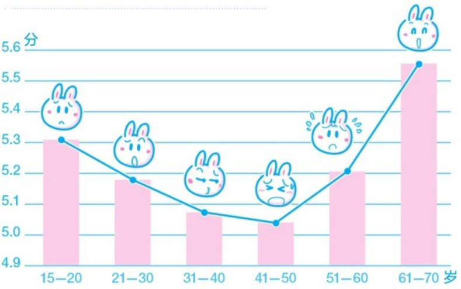

 ---

 title: 把时间当作朋友
 date: 2025-02-08 12:00:00 +0800
 categories: [Book]
 tags: [reading]

 ---

## 基本信息

- 作品名称：把时间当作朋友
- 作者：李笑来

## 笔记

### 1. 困境

1. **你能想象一张只有一个面的纸吗？——亚瑟·克拉克**

2. 问题：

    各种拖延或阻碍导致完成任务的时间不够
      - 没有按时开始执行任务
      - 错误估算完成任务的时间
      - 执行过程中出现了差错

3. 慌乱：

   - **矛盾存在：一个人既勤奋又懒惰**
   - 原因：没时间了
   - 结果：这种巨大的压力所造成的恐慌，往往可以使当事人作出荒诞不经、让其他人匪夷所思的决定：自相矛盾、自我欺骗、孤注一掷、痴心妄想……诸如此类，不一而足。

4. 解决：

   - “没时间了”这种尴尬就像是一把我们想要打开的锁。要想摆脱这种尴尬，死盯着这把锁是没有用的。
   - 所谓“管理时间”亦或“时间管理”是虚假的概念，是不可能完成的任务。时间不会服从任何人的管理，它只会自顾自地流逝。
   - **我们无法管理时间**——问题出在我们身上，必须要开启心智
   - **我们无法管理时间，我们只能管理自己**
   - 办法只有一个：**一切靠积累**

### 2. 醒悟

1. **真理往往是简洁的。——艾萨克·牛顿**

2. 神奇的现象：**我们竟然可以用自己的大脑控制自己的大脑。**

   - 我们甚至可以思考我们的思考方式和思考结果是否确实是合理的思考方式和思考结果。
   - **你的大脑并不是你，你的大脑是属于"你的"大脑。**

3. 你是可以控制你的大脑的———运用心智获得解放。

4. 什么是心智

   - 简单地说，一个人的心智就是其过往获得的一切知识及经验的总和（包括基于这些知识和经验造就的思考方法、思考模式）。

   - **人们可能会基于一模一样的原因作出截然相反的决定**
     
     - 人们常常会问：“学这东西有什么用呢？”其实，在尚未学习之前，对提问者来说，答案只能是“不知道”——尽管很多书籍中都已经花费大量的篇幅去论述“为什么要学习（某项技能）”。而“不知道那东西（对自己）有什么用”，恰恰是一部分人（更多一些）决定不学的原因，同时，它也是另一部分人（更少一些）决定去学的原因。
     
     - 一部分人从来都不问用途，只是自顾自学去了。许多年后，他自然而然地找到了这项技能的用处，享受了其已有技能所带来的种种好处。于是，这个既有经验成为他心智的一部分
     
     - 另一部分人只会说：“我没学也没什么。​”也许有一天，当他因为没有学习这项技能而遇到一点尴尬的时候，可能会慨叹：​“当初不懂事，要是学过就好了……然而，这对他来说，仅限于慨叹。再次遇到学习机会的时候，他依然会选择放弃，只不过除了“不知道学它有什么用”之外还多了一个理由：​“现在学也来不及了。​”
   
   - **关键**：**看穿这一切，摆脱自己的局限，需要心智的力量。**
   

### 3. 现实

1. **巨大的建筑，总是一木一石叠起来的，我们何妨做做这一木一石呢？我时常做些另碎事，就是为此。——鲁迅

2. 速成绝无可能：

   - 想要速成的原因：  

      - 人希望自己的欲望马上得到满足的天性。一个确定的事实是，几乎每个人都有无穷无尽的欲望。
      - 很多人不懂“有些阶段就是无法跨越”这个道理。
      - 自我满意度的不断下降。
      -  

   - 出路在哪
      - 出路肯定存在，但这出路只有一个起点——**接受现实**。告诉自己：我有不足，我需要时间，我没办法一蹴而就。
      - 速成不可能，那咋办————**换**
         - 不成熟的人有什么样的特征？他们的特征很多，但一个通病就是整天都在想“我要……”​，全然不顾自己其实一无所有
         - 最初每个人都一无所有，而后通过各种手段，或努力、或投机、或勤奋、或取巧，换取能够拥有的东西。
         - 大多数人之所以会浮躁，是因为他们**一无积累**（或者积累太少，几乎无法换取任何东西）​，二无**方法和经验**（所以求而不得）​。
         - 生活的本质就是这样，你想要什么，它偏不给你什么。摆脱这个死循环的方法只有一个——给我什么我就用好什么，积累到一定程度再去换能换的东西。
         - 当你想要什么的时候，要思考自己有什么，如何才能换到这样东西，如果没有，想办法积累。 

3. **完美主义不存在**

   - 大不列颠语料库的统计数据表明，最常与“完美主义者”(perfection-ist)这个词一并出现的词是“脆弱的”(vulnerable)。这不是偶然，这是人们在记录现实时自然使用的搭配。

   - 越是能力差的人，越有那种非常不现实又极其脆弱的完美主义倾向。

   - **他们不现实，是因为他们不懂。因为他们不懂，所以他们不现实；因为他们不现实，所以他们脆弱。他们很容易受伤，因为他们的要求太高，也因此总是做不到。**

   - 没有人能够做到完美。我们至多能做到接近完美，或者更接近完美。所以，我们不管做什么事情，都需要时刻忍耐各种各样的不完美，否则事情根本无法完成。最终完成的事情，结果也常常是不完美的。缺憾必然存在。

4. **未知永远存在**

   - 我们害怕未知，害怕不确定的东西。我们希望一切都在自己的掌握之中，只是我们永远做不到。
   - 为了进步，我们必须忍受一定的未知。
      - 不是“反对问为什么”​，而是“暂时不去问为什么”可能更划算。
   - 解决办法
      - 当有问题解决不了时，可以先把它**记下来，然后继续前行**。注意，一定要把问题记下来。很多人没有记录的习惯，以至出现曾经因为思考（疑问就是思考的起点）后“忘了”而失去获得答案机会的情况。继续前行，并不意味着忽略这些问题——它们已被记录在案，也由此获得了被重新审视的机会。

5. **现状无法马上摆脱**

   - 人们往往会低估环境的巨大能量。
      - 与外界的无谓比较，让每个人凭空多出了一个根本不属于自己的目标，动辄被自己的理想绑架。
   - 尽管天分确实很重要，但一个人的能力主要靠积累获得。
      - 很多人都在无意之间被自己的“梦想”所绑架，所以，很多时候，对很多人来说，所谓“梦想”也许只是陷阱。
      - 每一时刻的现状都是过去某一或者某些时刻的结果，而每一时刻的现状都是未来某一或者某些时刻的原因。没有人能够逃脱现实的束缚。
      - 对现状不满、急于摆脱现状，是人们常常不知不觉落入的陷阱（尽管偶尔这也是少数人真正的动力）​。接受现状才是最优策略——有什么做什么，有什么用什么；做什么都做好，用什么都用好。不要常常觉得苦（这会让人忍不住顾影自怜，浪费精力与时间）​，而要想办法在任何情况下找到情趣——快乐是一种本事。

6. **与时间做朋友**

   - 方法：**用正确的方法做正确的事情。**
      - 什么是正确的事
         - ** 核心只有一个：看它是否现实。**
      
      -什么是正确的方法
         -接受现实
            - 时间是现实的人的朋友，是不现实的人的敌人。时间不是故意要这样做，只不过事实就是如此。
   
### 4 .管理

1. **两点之间的最短距离是恶性循环。——墨菲拓扑定律**

2. 估算时间

   - 错误估算任务所需时间，是最常见，也是最致命的错误。
   - **侯世达法则**：
      - 完成一个任务实际花费的时间总会超过计划花费的时间，就算制定计划的时候考虑到本法则，也不能避免这种情况的发生。
      - 任务：一部分熟悉，一部分陌生。
      - 我们必须处理未知，而从陌生到熟悉，就需要花费时间去学习，这个过程无法逾越，并且没有捷径。

   - 正确估算时间
      - **做任何事情之前先判断其熟悉程度（或陌生程度）​，再据此判断估算完成任务所需要的时间**

3. 及时行动

   - **所谓做事拖延，不是拖延着做事，而是拖延着不开始做事**
      - 明明已经焦虑到不行，拖延的人为什么迟迟不开始行动？
         - “错误估算任务所需时间”
         - **本质：恐惧**——无论是来自内部的，还是来自外部的。
            - **内部：只要开始做事，一个人就要面临做错、做不好的风险。**
               - 一个简单的认知性错误，即认为那些能够做对、做好的人都是直接做对、做好的。
               - 只要做事，就一定会出问题。这是现实——无论何人，无论何事。如果在做事的过程中没有出现任何问题，那肯定不是在做事，而是在做梦。
            - **外部：过分在意外界的评价。**
               - 一个人一旦开始认真做事，被嘲弄、被耻笑的几率将远远高于被夸奖、被鼓励的几率——这几乎是肯定的。
               - 真正能够做对、做好的人，绝不会随意嘲弄、打击别人，因为他们是做对过、做好过的人，他们一路走过来，心里非常清楚做对、做好有多么不易，所以，他们会不吝一切机会去鼓励那些尝试做事情的人。
               - 这甚至可以当作一种测试方法：如果一个人经常嘲弄他人，那只能说明他自己不怎么样；否则，他会像那些极少数已经做对、做好的人一样，给予别人真诚的鼓励而非嘲弄。尽管那些能真正做对、做好的人有时也会给出负面评价，但这些评价通常是“建设性的负面评价”​，并不是为了获得优越感而发出的嘲弄。
               - 所以，我们没有必要在意来自他人的、非建设性的负面评价。
   - 在起步晚了的情况下，问题不是“到时候能不能做好”​，而是“到时候能做多好就做多好，总好过什么都不做”​。明白了这个道理，以后不管遇到什么任务，永远不要再问“什么时候开始才好”​，因为答案只有一个：现在！

4. 直面困难
   
   - 为什么有的人好像一直在忙，却总是拿不出成绩、做不出成效？
      - 无疑，他们的效率低下。而效率低下的根本原因是什么？答案是：**回避困难。**
   - 合理的时间安排应该是这样的：*迅速做完简单的部分，把节省出来的时间放在困难部分的处理上。*
   - 实际上很多人的做法：*用几乎全部时间处理简单的部分，至于困难的部分，干脆“掩耳盗铃”​，视而不见，暗地里希望困难自动消失……*
 
5. 关注步骤
   
   - 所谓“三思而行”在我看来就是指做任何事情之前都要考虑相关的3个方面：**内容(What)、原因(Why)、方法(How)**。任何任务都起码具备3个属性：何事(What)、何因(Why)、何法(How)。
   - 通常what和why显而易见，重要的是how
      - 思考方法需要从领悟内容入手，不停地细分、拆解任务，而且越具体越好，直至每个小任务都可以由一个人独立完成。

6. 并行串行

   - 提高效率”指的就是“原本只能串行完成的两个任务现在可以并行完成”​。
   - 并行两个任务的一个重要前提是执行者足够了解这两个任务，且对自己有足够清楚的认识，即，对执行者来说，这两个任务是“主动并行”的。
   
7. 感知时间

   - 做详细的记录，关于自己做过的事，并把花费的时间记录上去
   - 既然管理时间是不可能的，那么解决方法就只能是：想尽一切办法真正了解自己、真正了解时间、精确感知时间，而后再想尽一切办法使自己及自己的行为与时间“合拍”​。按我的话说就是——“与时间做朋友”​。

### 5 .学习

### 6. 思考

### 7. 交流

### 8. 应用

### 9. 积累
